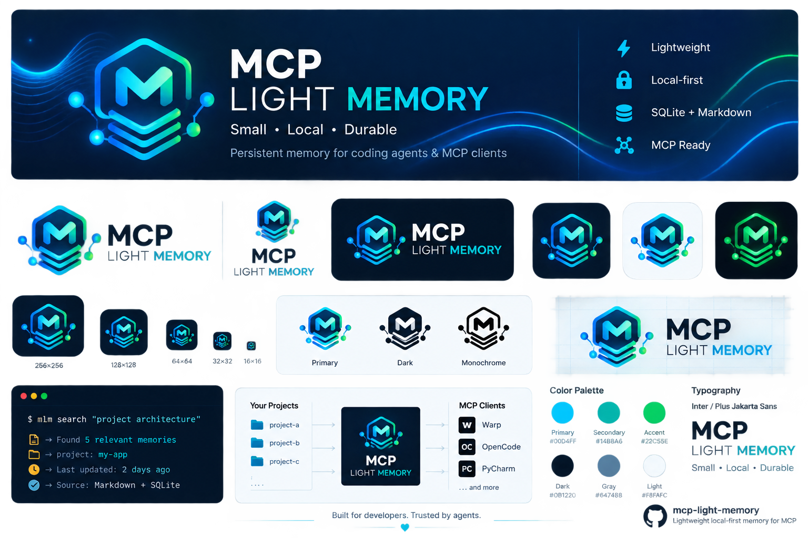

<p align="center">
  
</p>

<p align="center">
  
</p>

<h1 align="center">MCP Light Memory</h1>

<p align="center">
  Lightweight local-first persistent memory for coding agents and MCP clients.<br>
  <em>formerly <code>internal-rag</code></em>
</p>

<p align="center">
  
  
  
  
  
</p>

---

**MCP Light Memory** (package `mcp-light-memory`, CLI `mlm`) is a lightweight, local-first, persistent memory system for coding agents and MCP clients. It keeps the minimum state needed to resume complex work without keeping the full session history in the model's context window — a checkpoint + retrieval layer for your agent.

- **Local-first / offline-first** — no server, no cloud, no daemon. Markdown is the durable source of truth; SQLite is a rebuildable cache.
- **Zero required runtime dependencies** — pure Python 3.8+ stdlib. Optional `sentence-transformers`/`numpy` for better semantic retrieval.
- **MCP stdio server** — dual-era protocol support: modern `2026-07-28` (`server/discover`, `_meta`, `structuredContent`, `outputSchema`) + legacy `2024-11-05`…`2025-11-25`.
- **Multi-project router** — one MCP server in front of many projects with registry allowlist, `write:false` hard boundary, and per-call subprocess isolation.
- **Retrieved memory is untrusted evidence** — explicit trust boundary + prompt-injection warning heuristic (ADR-015).
- **Works with** Warp, OpenCode, Claude Code, Cursor, JetBrains AI Assistant / PyCharm.
- **Zero-shot setup** — paste one prompt from [`docs/ZERO-SHOT-SETUP-PROMPTS.md`](docs/ZERO-SHOT-SETUP-PROMPTS.md) into your agent and it installs + configures everything automatically.

**Version:** 1.7.3  
**Verified:** 2026-08-25  
**Integrations:** Warp, OpenCode, MCP (Claude Code / Cursor), JetBrains  
**Requirements:** Python 3.8+, Git  
**Optional:** `sentence-transformers`, `numpy` (better semantic retrieval)  
**Offline:** Fully functional without internet (BM25 core, optional pre-packaged embeddings)

> **Migration:** This project was formerly named `internal-rag`. Existing installs keep working — the `irag.py` module, `INTERNAL_RAG/` storage folder, and old MCP server names are preserved as deprecated aliases. The new primary CLI is `mlm` (`mlm.py`). See [docs/MIGRATION-TO-MCP-LIGHT-MEMORY.md](docs/MIGRATION-TO-MCP-LIGHT-MEMORY.md).

## What's new in 1.7.0 (rebrand to MCP Light Memory)

- **Total rebrand** from `internal-rag` to **MCP Light Memory** (`mcp-light-memory`). New product name, new CLI alias `mlm` (`mlm.py`), updated MCP server display name (`mcp-light-memory`), updated router display name (`mcp-light-memory-router`), refreshed README/docs/examples, new logo/icon assets (`docs/assets/`), branding note (`docs/BRANDING.md`), GitHub rebrand checklist (`docs/GITHUB-REBRAND-CHECKLIST.md`), and a dedicated migration document (`docs/MIGRATION-TO-MCP-LIGHT-MEMORY.md`).
- **Backward compatibility preserved**: the `irag.py` module filename, the `INTERNAL_RAG/` storage folder, and old MCP server names continue to work as deprecated aliases. No data migration required. Existing installs, scripts, and stored memories are unaffected.
- **New CLI shim `mlm.py`** — primary entrypoint that forwards to the canonical `irag.py` core. `irag.py` remains a supported legacy alias.
- **New router examples**: `examples/warp-router.example.json`, `examples/opencode-v2-router.example.jsonc`, `examples/jetbrains-router.example.json` for the multi-project router under the new name.
- **Tests extended** with a rebrand consistency suite (`tests/test_rebrand.py`) validating: `mlm.py` shim forwards correctly, MCP `serverInfo.name` is `mcp-light-memory` / `mcp-light-memory-router`, examples use the new server names, docs reference `MCP Light Memory`, legacy aliases still work.

## What's new in 1.6.1 (post-v1.6 hardening)

- **Memory mutation/lifecycle benchmark**: `tests/memory_mutation_benchmark.py` — deterministic, zero-dependency, 11 scenarios covering write/update/supersede/temporal/archive/export-import/index-rebuild/duplicate-protection. Asserts invariants: superseded memory not current truth, history never deleted, archived/invalid do not leak, export/import preserves lifecycle metadata, index deletion does not change durable semantics. `--smoke` canary for CI.
- **Trust boundary for retrieved memory (ADR-015)**: every retrieved memory is wrapped as `trust: untrusted` evidence. The `context` packet prints a `SECURITY NOTICE` header and delimits each memory with `=== BEGIN/END INTERNAL_RAG MEMORY ===`. Structured JSON / MCP `structuredContent` carries `"trust": "untrusted"`. An optional deterministic regex heuristic exposes `security_flags: ["instruction_like_content"]` for high-signal injection-like phrases (`SYSTEM:`, `ignore previous instructions`, `you are now`, …). WARNING only — never blocks, rewrites, or removes the original text; absence of the flag does NOT mean trusted. Adversarial tests in `tests/test_trust_boundary.py`.
- **Evidence freshness (ADR-016)**: retrieval/context exposes `evidence_state` (`present`/`missing`/`unverifiable`) for local path-like evidence. Derived at retrieval time, never persisted, no schema migration, no ranking change. Path-traversal-safe; symlinks tested.
- **Scale benchmark**: `tests/scale_benchmark.py` — synthetic corpora of 100 / 1,000 / 10,000 memories; measures index build, incremental update, pure-Python BM25, FTS5 path, hybrid (when embeddings available), context generation, DB size, p50/p95. `--smoke` skips the 10k case in CI.
- **MCP/router security regression suite**: extended `tests/test_mcp_router.py` — unknown/malformed project ids, missing root, root without INTERNAL_RAG, `write: "false"`/`0`/`1`, cross-project search/write isolation, path traversal, symlinked roots, malformed MCP args, modern + legacy protocol behavior after errors.
- **Docs consistency test**: `tests/test_docs_consistency.py` — validates documented project version, MCP protocol version sets, JSON examples parse, JSONC examples validate, example filenames referenced by docs exist. Canonical `SUPPORTED_VERSIONS` constant in `irag_mcp_protocol.py` is the single source of truth.
- **Docs drift fix**: `ARCHITECTURE.md`, `MEMORY-LIFECYCLE.md`, `CONFIG.md`, `MCP-MULTI-PROJECT.md`, `FILE-MAP.md` bumped to v1.6.x; MCP protocol-version lists aligned with the canonical constant; `CLI.md`/`README.md` document the new `trust`/`security_flags`/`evidence_state` fields.
- **ADR-015** (trust boundary) and **ADR-016** (evidence freshness) added.
- 249 tests pass (was 187); 0 required runtime dependencies; no retrieval-quality regression.

## What's new in 1.6.0

- **Memory-quality benchmark**: `tests/memory_quality_benchmark.py` — deterministic, zero-dependency, 37 cases over a realistic coding-memory fixture corpus (identifiers, paths, paraphrase, PL/EN/mixed, superseded, temporal, contradictions, failures, abstention). Reports Recall@1/3/5, MRR, abstention P/R/F1, temporal accuracy, leakage, latency, tokens. `--smoke` canary for CI.
- **Memory mutation/lifecycle benchmark**: `tests/memory_mutation_benchmark.py` — deterministic, zero-dependency, 11 scenarios covering write/update/supersede/temporal/archive/export-import/index-rebuild/duplicate-protection. Asserts invariants: superseded memory not current truth, history never deleted, archived/invalid do not leak, export/import preserves lifecycle metadata, index deletion does not change durable semantics. `--smoke` canary for CI.
- **Trust boundary for retrieved memory (ADR-015)**: every retrieved memory is wrapped as `trust: untrusted` evidence. The `context` packet prints a `SECURITY NOTICE` header and delimits each memory with `=== BEGIN/END INTERNAL_RAG MEMORY ===`. Structured JSON / MCP `structuredContent` carries `"trust": "untrusted"`. An optional deterministic regex heuristic exposes `security_flags: ["instruction_like_content"]` for high-signal injection-like phrases (`SYSTEM:`, `ignore previous instructions`, `you are now`, …). WARNING only — never blocks, rewrites, or removes the original text; absence of the flag does NOT mean trusted. Adversarial tests in `tests/test_trust_boundary.py`.
- **Evidence freshness (ADR-016)**: retrieval/context exposes `evidence_state` (`present`/`missing`/`unverifiable`) for local path-like evidence. Derived at retrieval time, never persisted, no schema migration, no ranking change. Path-traversal-safe; symlinks tested.
- **Scale benchmark**: `tests/scale_benchmark.py` — synthetic corpora of 100 / 1,000 / 10,000 memories; measures index build, incremental update, pure-Python BM25, FTS5 path, hybrid (when embeddings available), context generation, DB size, p50/p95. `--smoke` skips the 10k case in CI.
- **MCP/router security regression suite**: extended `tests/test_mcp_router.py` — unknown/malformed project ids, missing root, root without INTERNAL_RAG, `write: "false"`/`0`/`1`, cross-project search/write isolation, path traversal, symlinked roots, malformed MCP args, modern + legacy protocol behavior after errors.
- **Docs consistency test**: `tests/test_docs_consistency.py` — validates documented project version, MCP protocol version sets, JSON examples parse, JSONC examples validate, example filenames referenced by docs exist. Canonical `SUPPORTED_VERSIONS` constant in `irag_mcp_protocol.py` is the single source of truth.
- **MCP 2026-07-28 (dual-era)**: `server/discover` (no `initialize` required), per-request `_meta`, `resultType`, `structuredContent`, `outputSchema`, `ttlMs`/`cacheScope`. Legacy lifecycle unchanged. Shared `irag_mcp_protocol.py`.
- **Better MCP schema**: precise `inputSchema` (types, enums, `required`, `minimum`, `additionalProperties: false`), tool `annotations` (`openWorldHint: false`), `outputSchema`+`structuredContent` for search/status/tasks/projects/guard. MCP `search` accepts `at` + `explain`.
- **Registry strict `write`**: must be a JSON boolean — `"false"`/`0`/`1` rejected.
- **Sources in chunk prefix**: file paths and symbol names in `sources`/`evidence` are searchable via the sparse channel (bounded, deterministic chunk IDs).
- **Adaptive retrieval** (`mode: adaptive`, opt-in): sparse first, dense only if weak — benchmark-gated, not default.
- **Bounded link-aware context**: `context` expands 1-hop over `links`/`supersedes`/`derived_from`/`superseded_by` (budget-capped, provenance, archived isolation, cycle guard).
- **`consolidate --prepare`**: deterministic JSON segment packet (no LLM, no auto-write).
- **Router latency benchmark**: ~64ms overhead → no persistent child pool (ADR-014).
- **Client docs**: `docs/MCP.md` rewritten + `examples/` for Warp, OpenCode V2/legacy, JetBrains, router.
- **ADR-010…016** for the architectural decisions.
- `confidence_kind: "heuristic"` labels abstention confidence honestly.

## What's new in 1.5.0

- **Relevance / abstention gate**: retrieval separates raw evidence from policy ranking. `search --json --meta` wraps results with `abstained`, `retrieval_confidence` (0–1), `reason`, `admitted`, `rejected`, `rejected_detail` — the agent can detect "no usable answer" instead of trusting a low-relevance hit. Plain `--json` stays a bare list (backward compatible).
- **FTS5 candidate prefilter** (`retrieval.fts_prefilter.*`): optional accelerator — FTS5 top-n ∪ Python BM25 top-k narrows the scoring pool without changing the ranking and never drops a hit the full scan returns. Automatic fallback (stale/missing index, tiny corpus, FTS5 unavailable) keeps zero-dependency behavior.
- **Multi-project MCP router** (`irag_mcp_router.py`): one MCP server in front of many projects — registry allowlist, `write:false` blocks mutating tools, per-call subprocess isolation, `projects` tool. Zero required dependencies. See [docs/MCP-MULTI-PROJECT.md](docs/MCP-MULTI-PROJECT.md).
- **MCP protocol hardening**: pure-stdout JSON-RPC 2.0, `initialize` version negotiation (`2025-11-25` / `2025-06-18` / `2025-03-26` / `2024-11-05`), `ping`, deterministic `tools/list`; verified against the official `mcp` Python SDK client.
- **Config correctness**: recursive `deep_merge` (overriding one leaf never drops sibling defaults), deeper YAML-subset parser (block lists), `config --validate` covers `abstention` + `fts_prefilter`.
- **CI**: `.github/workflows/ci.yml` — tests matrix (Ubuntu py3.8 / py3.12, Windows py3.12): compile gate, `self_test.py`, full `unittest` suite, retrieval benchmarks; separate `mcp-compat` job with the official `mcp` SDK in its own venv.
- **Regression tests** (168 total): fingerprint cache (tracked-change detection despite cache), admission gate, MCP server protocol/stdout-purity, config deep-merge, MCP SDK handshake.
- **ADR**: [docs/ADR.md](docs/ADR.md) records the key architectural decisions (why no vector DB / background daemon / mandatory SDK).

## What's new in 1.4.0

- **Section-aware chunking**: memories split by Markdown headings; chunk-level retrieval with parent merge + MMR (`retrieval.chunking.*`, schema v3).
- **Read-only search**: usage tracking lives in the SQLite usage store; `migrate-usage` with backups; rebuilds preserve usage.
- **SimHash dedup**: exact (SHA-256) + near (64-bit SimHash, stdlib); conflict detection kept separate; `remember --json` duplicate/conflict shape.
- **Multilingual PL/EN profile**: `retrieval.profile: english-fast | multilingual` (intfloat/multilingual-e5-small, `query:`/`passage:` prefixes); cache keys include model identity; benchmark-justified PL stopword list.
- **Temporal knowledge lifecycle**: optional `confidence`/`valid_from`/`valid_to`/`supersedes`/`derived_from` (schema-1 compatible); `supersede` links both directions without deleting history; `search --at YYYY-MM-DD`; `timeline` by effective validity; `context` HISTORY & CONFLICTS section.
- **`consolidate --dry-run --json`**: deterministic read-only report (duplicates, superseded, archived, never-accessed old, old snapshots, conflicting active) + `plan` for the agent; no deletion, no LLM summarization.

## What's new in 1.3.0

- **Persistent embedding cache** in SQLite (schema v2): chunk-level float32 BLOBs, multiple models coexist, `index --vacuum`/`--embed-missing`.

## What's new in 1.0.2

- **Token budget enforcement**: `context` cuts memories to fit `context_budget` (sorted by score).
- **Stale memory detection**: `validate` warns when evidence paths no longer exist.
- **Duplicate detection**: `remember` blocks duplicates (use `--force` to override).
- **Privacy scan at write-time**: `remember` refuses secrets (use `--allow-secret` to bypass).
- **Auto-checkpoint timer**: `guard`/`context` warn if checkpoint is too old (`max_age_minutes`).
- **Recent commits in context**: `context` shows last 5 git commits for recovery.
- **Offline / air-gapped**: `pack.py` creates self-contained ZIP with wheels + model.

- Full English documentation.
- `search --json` now returns `matched_tokens`.
- `remember --links` stored in frontmatter.
- MCP server handles `notifications/initialized` and `shutdown`.
- `compact` preserves sections (trims long lists, not the structure).
- `privacy_check.py` now audits `.irag.yml`.
- `requirements-optional.txt` for embeddings.
- `--quiet` / `--verbose` global flags.
- `history` command (checkpoint history).
- `forget-task <id>` (drop a specific task, not just clear-all).
- `resume` updates WORKING_STATE sections.
- `config --init` generates a `.irag.yml` template.
- `--embeddings on|off|auto` CLI override.
- `show --section <name>` extracts a single section.
- Schema versioning in `.checkpoint.json` / `.tasks.json`.
- `.gitignore` covers `.tasks.json`, `.fpcache.json`, `exports/`.
- New docs: `docs/CLI.md`, `docs/GIT-HOOKS.md`.
- README badges.
- Extended `self_test.py` (CRUD, MCP, hooks).

## What's new in 1.0.0

- **BM25 + MMR retrieval** with optional embeddings (zero-dep fallback).
- **Full memory CRUD**: `show`, `update`, `supersede`, `forget`, `link`, `status`, `diff`, `timeline`.
- **Task stack**: `push` / `tasks` / `resume` / `forget-task` for interrupts.
- **Compaction**: `compact` before context compaction.
- **MCP server**: `irag.py mcp` (JSON-RPC stdio) for Claude Code / Cursor.
- **Git hooks** (optional): auto-checkpoint after commit, pre-push warning.
- **Diagnostics**: `doctor`, `embeddings-info`, `config`.
- **Memory transfer**: `export` / `import` (JSON).
- **Token budget**: token estimation in `context`.
- **`--json`** for all structured commands.

## Quick start

### One-command install + client registration (recommended)

Clone this repo once, then install into any project and auto-register the MCP
server in your client:

```powershell
# Windows (PowerShell)
git clone https://github.com/PeterPirog/mcp-light-memory.git ~/mcp-light-memory
python ~/mcp-light-memory/install.py . --client warp          # project-local config
# or --global for ~/.warp/.mcp.json; or --client opencode / --client jetbrains
```

```bash
# Linux/macOS
git clone https://github.com/PeterPirog/mcp-light-memory.git ~/mcp-light-memory
python3 ~/mcp-light-memory/install.py . --client warp
```

The installer:
- copies skill files + creates `INTERNAL_RAG/` + `AGENTS.md`
- runs `init` + `checkpoint` + `validate` (so `guard` is `OK` immediately)
- **auto-registers** the MCP server in the correct client config file
- writes the **absolute path** to the Python interpreter (survives Windows PATH issues)

Restart Warp/OpenCode/PyCharm, then:

```powershell
python .agents\skills\internal-rag\mlm.py context --task "current task"
```

### Zero-shot agent prompts

Prefer your agent to do everything? Paste a prompt from
[`docs/ZERO-SHOT-SETUP-PROMPTS.md`](docs/ZERO-SHOT-SETUP-PROMPTS.md) into Warp /
OpenCode / PyCharm — it clones, installs, registers, and verifies automatically.

### Legacy manual install

```powershell
python .\install.py "D:\path\to\project"
```

Then:

```powershell
python .agents\skills\internal-rag\mlm.py context --task "current task"
```

### Path mapping (rebrand: internal-rag → MCP Light Memory)

| New name | Legacy path (kept for compatibility) |
|---|---|
| `MCP Light Memory` (product) | `internal-rag` (deprecated product name) |
| `mlm` / `mlm.py` (primary CLI) | `irag.py` (legacy alias, still works) |
| `mcp-light-memory` (MCP server name) | `internal-rag` (legacy, still works in configs) |
| `mcp-light-memory-router` (router name) | `internal-rag-router` (legacy) |
| `INTERNAL_RAG/` (storage folder — unchanged) | — |
| `.agents/skills/internal-rag/` (skill dir — unchanged) | — |

The on-disk folder `INTERNAL_RAG/` and the skill directory
`.agents/skills/internal-rag/` are intentionally kept under their legacy names
for **zero-migration** backward compatibility. See
[`docs/MIGRATION-TO-MCP-LIGHT-MEMORY.md`](docs/MIGRATION-TO-MCP-LIGHT-MEMORY.md).

## Workflow

```text
context
  ↓
recovery, if required
  ↓
checkpoint before first change
  ↓
implementation
  ↓
checkpoint after each milestone
  ↓
guard before finishing
```

Core commands:

```text
irag.py context --task "..."
irag.py checkpoint --reason "..."
irag.py search --query "..." --limit 8
irag.py remember --type decision --title "..." --body "..."
irag.py show <ref>
irag.py update <ref> --status superseded
irag.py status
irag.py guard
irag.py validate
irag.py doctor
```

## Durable memory (CRUD)

```text
remember --type decision --title "..." --body "..." --tags "a,b" --evidence "src/x.py:42" --links "decisions/other.md"
show <path-or-id>
show <ref> --section Knowledge
update <ref> --add-tags "new" --append "New evidence: ..."
supersede <ref> --by <new> --reason "..."
forget <ref>              # archives, does not delete
link --from <ref> --to <ref>
timeline --limit 20
status
history
```

Types: `decision`, `knowledge`, `constraint`, `gotcha`, `failure`, `hypothesis`, `session`.

## Task stack (interrupts)

```text
irag.py push --task "interrupted work" --reason "user-priority"
irag.py tasks
irag.py resume
irag.py forget-task <id>   # drop a specific task
irag.py forget-task         # clear the whole stack
```

## MCP server (Claude Code / Cursor)

```bash
python3 .agents/skills/internal-rag/irag.py mcp
```

Minimal JSON-RPC stdio: `context`, `search`, `checkpoint`, `guard`, `remember`, `status`, `tasks`, `resume`.

**Multi-project router (v1.5.0):**

```bash
python3 .agents/skills/internal-rag/irag_mcp_router.py --registry projects.json
```

One MCP connection in front of many projects — registry allowlist, `write:false` blocks mutating tools, per-call isolation. See [docs/MCP-MULTI-PROJECT.md](docs/MCP-MULTI-PROJECT.md).

## Git hooks (optional, auto-checkpoint)

```bash
python3 .agents/skills/internal-rag/irag_hooks.py install
python3 .agents/skills/internal-rag/irag_hooks.py status
python3 .agents/skills/internal-rag/irag_hooks.py uninstall
```

Hooks never block git operations.

## Configuration (`.irag.yml`, optional)

```yaml
retrieval:
  limit: 10
  mmr_lambda: 0.4
  min_score: 0.3
  embeddings: auto        # auto | on | off
  profile: english-fast   # english-fast (default) | multilingual (PL/EN projects)
  embeddings_model: null  # explicit model overrides the profile
tokens:
  context_budget: 5000
checkpoints:
  auto_archive_sessions: true
  max_task_stack: 24
```

`irag.py config` shows the effective configuration. `irag.py config --init` writes a template.

## Diagnostics & transfer

```text
irag.py doctor
irag.py embeddings-info
irag.py export                  # -> INTERNAL_RAG/exports/
irag.py import <file.json> --overwrite
irag.py config
irag.py history
```

## Optional embeddings (better retrieval)

```bash
pip install -r requirements-optional.txt
```

When the package is available and `.irag.yml` has `embeddings: auto` (default), retrieval uses embeddings with fallback to BM25. Override at runtime with `--embeddings on|off|auto`.

Two retrieval profiles are supported (see `docs/EMBEDDINGS.md`):
- `english-fast` (default, `all-MiniLM-L6-v2`) — unchanged for existing users.
- `multilingual` (`intfloat/multilingual-e5-small`, `query:`/`passage:` prefixes) — the officially supported choice for Polish-English projects; not the default until your benchmark justifies it.

## Offline / air-gapped

INTERNAL_RAG works fully offline (BM25 core, zero dependencies). For embeddings on air-gapped machines:

```bash
# On a machine with internet (pick your profile):
python pack.py --with-embeddings --profile english-fast
# for a PL/EN project:
python pack.py --with-embeddings --profile multilingual
# -> internal-rag-offline-1.5.0.zip

# On the air-gapped machine:
unzip internal-rag-offline-*.zip -d internal-rag-offline
cd internal-rag-offline
pip install --no-index --find-links wheels/ -r requirements-optional.txt
python install.py "/path/to/project"
```

See `docs/OFFLINE.md` for details.

## Privacy & Git

The default install mode is **local-only**. The installer uses `.git/info/exclude`, not the project's `.gitignore`, so local memory and integration files are not accidentally committed.

Before publishing a project:

```powershell
python .\privacy_check.py "D:\path\to\project"
```

Expected result:

```text
RESULT: PASS
```

## Full removal from a project

```powershell
python .\uninstall.py "D:\path\to\project"
```

The uninstaller creates a backup outside the repository, then removes INTERNAL_RAG and its integrations. To keep the memory, use `--keep-memory`.

## Documentation

- [Installation](docs/INSTALLATION.md)
- [Daily usage](docs/DAILY-USAGE.md)
- [CLI reference](docs/CLI.md)
- [Architecture](docs/ARCHITECTURE.md)
- [Memory lifecycle](docs/MEMORY-LIFECYCLE.md)
- [Recovery](docs/RECOVERY.md)
- [Warp](docs/WARP.md)
- [OpenCode](docs/OPENCODE.md)
- [MCP](docs/MCP.md)
- [Multi-project MCP](docs/MCP-MULTI-PROJECT.md)
- [Architecture decisions (ADR)](docs/ADR.md)
- [Configuration](docs/CONFIG.md)
- [Embeddings](docs/EMBEDDINGS.md)
- [Offline / air-gapped](docs/OFFLINE.md)
- [Git hooks](docs/GIT-HOOKS.md)
- [Privacy & Git](docs/PRIVACY-AND-GIT.md)
- [Uninstall](docs/UNINSTALL.md)
- [Troubleshooting](docs/TROUBLESHOOTING.md)
- [File map](docs/FILE-MAP.md)
- [Compatibility](docs/COMPATIBILITY.md)
- [GitHub publishing](docs/GITHUB-PUBLISHING.md)

## Structure in a target project

```text
project/
├── AGENTS.md
├── .irag.yml                    # optional config
├── INTERNAL_RAG/
│   ├── WORKING_STATE.md
│   ├── INDEX.md
│   ├── .checkpoint.json
│   ├── .tasks.json
│   ├── .fpcache.json
│   ├── exports/
│   ├── decisions/
│   ├── knowledge/
│   ├── gotchas/
│   ├── failures/
│   ├── hypotheses/
│   ├── sessions/
│   │   └── .snapshots/
│   └── archive/
├── .agents/skills/internal-rag/
│   ├── SKILL.md
│   ├── irag.py
│   ├── irag_embeddings.py       # optional plugin
│   └── irag_hooks.py            # optional git hooks
└── .opencode/
    ├── tools/
    ├── commands/
    └── plugins/
```

## Source of truth

1. current user instructions,
2. current code/tests/configuration,
3. specifications/ADRs,
4. verified memory,
5. session notes,
6. hypotheses.

Memory can be stale. Code takes precedence.

## License

MIT.